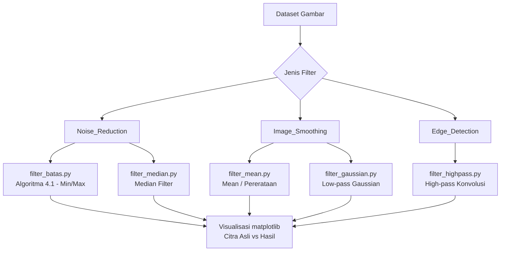
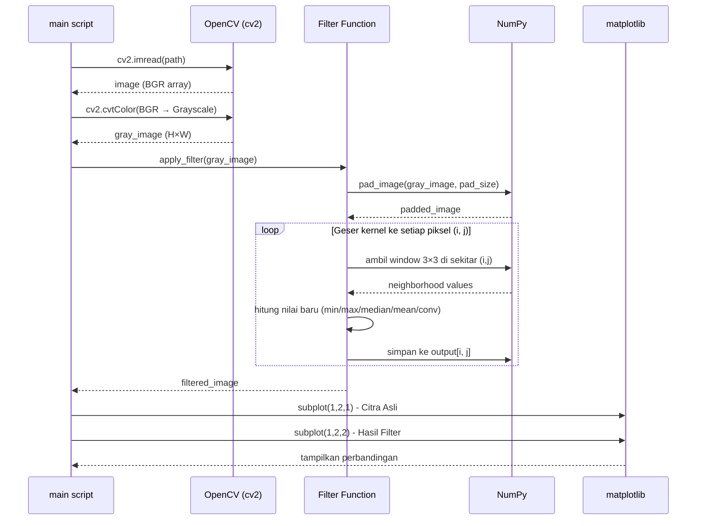
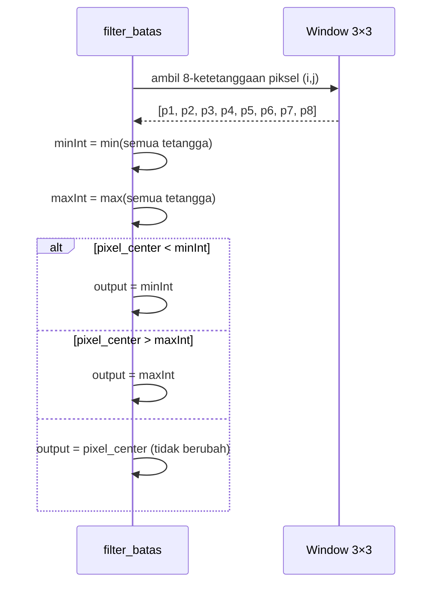
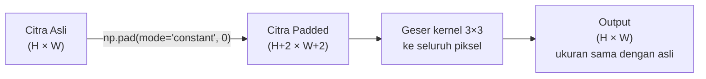

# Design Document: Pixel Neighborhood Filter

## Overview

Proyek ini mengimplementasikan berbagai filter berbasis operasi ketetanggaan piksel (pixel neighborhood operations) untuk tugas UTS Pengolahan Citra Digital (PCD). Proyek diorganisir dalam tiga folder sesuai fungsi filter: `Noise_Reduction`, `Image_Smoothing`, dan `Edge_Detection`, masing-masing menggunakan dataset gambar yang sudah tersedia.

Setiap filter bekerja dengan prinsip yang sama: menggeser kernel (jendela) berukuran 3×3 atau lebih besar ke seluruh piksel citra, lalu menghitung nilai baru berdasarkan piksel-piksel tetangga di dalam jendela tersebut. Perbedaan utama antar filter terletak pada fungsi agregasi yang digunakan (min/max, median, rata-rata, Gaussian, atau konvolusi kernel tepi).

## Architecture



## Sequence Diagrams

### Alur Umum Semua Filter



### Alur Khusus Filter Batas (Algoritma 4.1)



## Penanganan Masalah Tepi (Border/Edge Problem)

Masalah tepi terjadi ketika kernel 3×3 digeser ke piksel-piksel di pinggir citra — piksel pojok hanya memiliki 3 tetangga, piksel tepi hanya 5 tetangga, sehingga window tidak bisa diisi penuh.

### Strategi: Zero Padding (Constant Padding)

Solusi yang digunakan adalah **zero padding**: menambahkan baris dan kolom bernilai 0 di sekeliling citra sebelum proses filtering dimulai.



**Mekanisme:**
- Sebelum filtering: `padded = np.pad(image, pad_width=1, mode='constant', constant_values=0)`
- Kernel 3×3 digeser mulai dari posisi `(1,1)` hingga `(H, W)` pada citra padded
- Piksel tepi pada citra asli kini memiliki tetangga lengkap (nilai 0 dari padding)
- Output akhir berukuran sama dengan citra asli `(H × W)`

**Konsekuensi:** Piksel di tepi citra output mungkin sedikit lebih gelap karena tetangga padding bernilai 0. Untuk tugas ini, zero padding sudah cukup dan mudah dipahami.

**Alternatif (tidak diimplementasikan):** `mode='reflect'` (mencerminkan piksel tepi) atau `mode='edge'` (mereplikasi piksel tepi) — menghasilkan tepi yang lebih natural.

## Components and Interfaces

### Komponen 1: Noise_Reduction

**Tujuan**: Menghilangkan noise salt-and-pepper menggunakan filter non-linear.

**Interface:**
```python
def filter_batas(image: np.ndarray, kernel_size: int = 3) -> np.ndarray:
    """
    Algoritma 4.1: Filter Batas (Non-linear)
    Menggunakan minInt dan maxInt dari 8-ketetanggaan piksel.
    """

def filter_median(image: np.ndarray, kernel_size: int = 3) -> np.ndarray:
    """
    Filter Median: mengganti piksel dengan nilai median dari window.
    """
```

**Tanggung Jawab:**
- Membaca Salt-Noise.jpg dan Pepper-Noise.jpg
- Menerapkan filter_batas dan filter_median
- Menampilkan perbandingan 4 panel: Salt Asli, Salt Filtered, Pepper Asli, Pepper Filtered

### Komponen 2: Image_Smoothing

**Tujuan**: Menghaluskan citra dengan mengurangi detail frekuensi tinggi.

**Interface:**
```python
def filter_mean(image: np.ndarray, kernel_size: int = 3) -> np.ndarray:
    """
    Filter Pererataan (Mean): rata-rata nilai piksel dalam window.
    """

def filter_gaussian(image: np.ndarray, kernel_size: int = 3, sigma: float = 1.0) -> np.ndarray:
    """
    Low-pass Gaussian Filter: pembobotan Gaussian pada window.
    """
```

**Tanggung Jawab:**
- Membaca istockphoto-1259150014-612x612.jpg
- Menerapkan mean filter dan Gaussian filter
- Menampilkan perbandingan 3 panel: Asli, Mean, Gaussian

### Komponen 3: Edge_Detection

**Tujuan**: Mendeteksi dan mempertajam tepi objek dalam citra.

**Interface:**
```python
def filter_highpass(image: np.ndarray, kernel: np.ndarray = None) -> np.ndarray:
    """
    High-pass Filter: konvolusi kernel untuk menajamkan tepi.
    """
```

**Tanggung Jawab:**
- Membaca 1035.jpg
- Menerapkan high-pass filter dengan kernel Laplacian
- Menampilkan perbandingan 2 panel: Asli vs Hasil

## Data Models

### Model Citra

```python
# Representasi internal semua citra
image: np.ndarray  # shape (H, W) untuk grayscale, dtype=uint8, nilai [0, 255]

# Kernel konvolusi
kernel: np.ndarray  # shape (k, k), dtype=float32 atau int, jumlah elemen = k²
```

### Kernel yang Digunakan

```python
# Mean Filter Kernel (3×3)
kernel_mean = np.ones((3, 3), dtype=np.float32) / 9

# Gaussian Kernel (3×3, sigma=1)
kernel_gaussian = np.array([
    [1, 2, 1],
    [2, 4, 2],
    [1, 2, 1]
], dtype=np.float32) / 16

# High-pass / Laplacian Kernel (3×3)
kernel_highpass = np.array([
    [ 0, -1,  0],
    [-1,  4, -1],
    [ 0, -1,  0]
], dtype=np.float32)
```

## Algorithmic Pseudocode

### Algoritma 4.1 — Filter Batas (Non-linear)

```pascal
ALGORITHM filter_batas(image, kernel_size=3)
INPUT: image (H×W grayscale array), kernel_size (integer, default 3)
OUTPUT: output (H×W filtered array)

PRECONDITION: image.dtype = uint8, kernel_size is odd integer >= 3
POSTCONDITION: output.shape = image.shape, semua nilai dalam [0, 255]

BEGIN
  pad ← kernel_size DIV 2
  padded ← np.pad(image, pad, mode='constant', constant_values=0)
  output ← np.zeros_like(image)

  FOR i ← 0 TO H-1 DO
    FOR j ← 0 TO W-1 DO
      // Ambil window 3×3 di sekitar piksel (i, j) dari citra padded
      window ← padded[i : i+kernel_size, j : j+kernel_size]

      // Pisahkan piksel pusat dari 8-ketetanggaan
      center ← window[pad, pad]
      neighbors ← window.flatten() tanpa center

      // Hitung batas bawah dan atas dari tetangga
      minInt ← min(neighbors)
      maxInt ← max(neighbors)

      // Terapkan logika filter batas
      IF center < minInt THEN
        output[i, j] ← minInt
      ELSE IF center > maxInt THEN
        output[i, j] ← maxInt
      ELSE
        output[i, j] ← center   // piksel tidak berubah
      END IF
    END FOR
  END FOR

  RETURN output
END
```

**Preconditions:**
- `image` adalah array 2D grayscale dengan dtype uint8
- `kernel_size` adalah bilangan ganjil ≥ 3

**Postconditions:**
- `output` berukuran sama dengan `image`
- Piksel yang merupakan noise (outlier) diganti dengan nilai batas tetangga
- Piksel normal tidak berubah

**Loop Invariants:**
- Setiap iterasi `(i, j)`: semua piksel pada baris sebelumnya sudah diproses
- `output[i, j]` selalu berada dalam rentang `[minInt, maxInt]` dari tetangganya

---

### Algoritma Filter Median

```pascal
ALGORITHM filter_median(image, kernel_size=3)
INPUT: image (H×W grayscale array), kernel_size (integer, default 3)
OUTPUT: output (H×W filtered array)

PRECONDITION: image.dtype = uint8, kernel_size is odd integer >= 3
POSTCONDITION: output.shape = image.shape

BEGIN
  pad ← kernel_size DIV 2
  padded ← np.pad(image, pad, mode='constant', constant_values=0)
  output ← np.zeros_like(image)

  FOR i ← 0 TO H-1 DO
    FOR j ← 0 TO W-1 DO
      // Ambil window dan hitung median
      window ← padded[i : i+kernel_size, j : j+kernel_size].flatten()
      output[i, j] ← median(window)
    END FOR
  END FOR

  RETURN output
END
```

**Loop Invariants:**
- Semua piksel yang sudah diproses memiliki nilai median dari window-nya

---

### Algoritma Mean Filter

```pascal
ALGORITHM filter_mean(image, kernel_size=3)
INPUT: image (H×W grayscale array), kernel_size (integer, default 3)
OUTPUT: output (H×W filtered array)

PRECONDITION: image.dtype = uint8, kernel_size is odd integer >= 3
POSTCONDITION: output.shape = image.shape

BEGIN
  pad ← kernel_size DIV 2
  padded ← np.pad(image, pad, mode='constant', constant_values=0)
  output ← np.zeros_like(image)

  FOR i ← 0 TO H-1 DO
    FOR j ← 0 TO W-1 DO
      // Ambil window dan hitung rata-rata
      window ← padded[i : i+kernel_size, j : j+kernel_size]
      output[i, j] ← mean(window)   // dibulatkan ke integer
    END FOR
  END FOR

  RETURN output
END
```

---

### Algoritma Gaussian Filter

```pascal
ALGORITHM filter_gaussian(image, kernel_size=3, sigma=1.0)
INPUT: image (H×W grayscale array), kernel_size, sigma
OUTPUT: output (H×W filtered array)

PRECONDITION: image.dtype = uint8, kernel_size is odd integer >= 3, sigma > 0
POSTCONDITION: output.shape = image.shape

BEGIN
  // Buat kernel Gaussian 2D
  kernel ← generate_gaussian_kernel(kernel_size, sigma)
  // kernel[x,y] = exp(-(x²+y²)/(2σ²)) / (2πσ²), dinormalisasi agar sum=1

  pad ← kernel_size DIV 2
  padded ← np.pad(image, pad, mode='constant', constant_values=0)
  output ← np.zeros_like(image)

  FOR i ← 0 TO H-1 DO
    FOR j ← 0 TO W-1 DO
      // Konvolusi: jumlah perkalian elemen window dengan kernel
      window ← padded[i : i+kernel_size, j : j+kernel_size]
      output[i, j] ← sum(window * kernel)   // dibulatkan ke integer
    END FOR
  END FOR

  RETURN output
END
```

---

### Algoritma High-pass Filter (Konvolusi Kernel Tepi)

```pascal
ALGORITHM filter_highpass(image, kernel=Laplacian_3x3)
INPUT: image (H×W grayscale array), kernel (3×3 array)
OUTPUT: output (H×W edge-enhanced array)

PRECONDITION: image.dtype = uint8, kernel.shape = (3,3)
POSTCONDITION: output.shape = image.shape, nilai di-clip ke [0, 255]

BEGIN
  pad ← 1
  padded ← np.pad(image, pad, mode='constant', constant_values=0)
  output ← np.zeros(image.shape, dtype=np.float32)

  FOR i ← 0 TO H-1 DO
    FOR j ← 0 TO W-1 DO
      // Konvolusi: jumlah perkalian elemen window dengan kernel Laplacian
      window ← padded[i : i+3, j : j+3]
      output[i, j] ← sum(window * kernel)
    END FOR
  END FOR

  // Clip nilai ke rentang valid uint8
  output ← clip(output, 0, 255).astype(uint8)

  RETURN output
END
```

**Postconditions:**
- Tepi objek tampak lebih jelas (nilai tinggi di area transisi)
- Area homogen mendekati 0 (gelap)
- Semua nilai di-clip ke `[0, 255]`

## Key Functions with Formal Specifications

### `apply_filter_batas(image, kernel_size=3)`

```python
def apply_filter_batas(image: np.ndarray, kernel_size: int = 3) -> np.ndarray
```

**Preconditions:**
- `image` adalah array 2D, dtype uint8, shape `(H, W)`
- `kernel_size` adalah bilangan ganjil, `kernel_size >= 3`

**Postconditions:**
- Return array shape `(H, W)`, dtype uint8
- `∀ (i,j): output[i,j] ∈ [minNeighbor(i,j), maxNeighbor(i,j)]`
- Piksel yang bukan noise tidak berubah nilainya

**Loop Invariants:**
- Setiap iterasi: `output[i,j]` sudah dihitung untuk semua `(i',j') < (i,j)` dalam urutan row-major

---

### `apply_filter_median(image, kernel_size=3)`

```python
def apply_filter_median(image: np.ndarray, kernel_size: int = 3) -> np.ndarray
```

**Preconditions:**
- `image` adalah array 2D, dtype uint8

**Postconditions:**
- Return array shape sama dengan input
- `∀ (i,j): output[i,j] = median(window_at(i,j))`
- Noise impulsif (salt/pepper) tereliminasi karena median tidak sensitif terhadap outlier

---

### `apply_filter_mean(image, kernel_size=3)`

```python
def apply_filter_mean(image: np.ndarray, kernel_size: int = 3) -> np.ndarray
```

**Postconditions:**
- `∀ (i,j): output[i,j] = round(mean(window_at(i,j)))`
- Citra menjadi lebih halus (blur), detail frekuensi tinggi berkurang

---

### `apply_filter_gaussian(image, kernel_size=3, sigma=1.0)`

```python
def apply_filter_gaussian(image: np.ndarray, kernel_size: int = 3, sigma: float = 1.0) -> np.ndarray
```

**Postconditions:**
- `∀ (i,j): output[i,j] = round(sum(window_at(i,j) * gaussian_kernel))`
- Piksel dekat pusat window diberi bobot lebih besar dari piksel tepi window

---

### `apply_filter_highpass(image, kernel)`

```python
def apply_filter_highpass(image: np.ndarray, kernel: np.ndarray) -> np.ndarray
```

**Postconditions:**
- `∀ (i,j): output[i,j] = clip(sum(window_at(i,j) * kernel), 0, 255)`
- Tepi objek memiliki nilai tinggi, area datar mendekati 0

## Example Usage

```python
import cv2
import numpy as np
import matplotlib.pyplot as plt

# --- Contoh: Filter Batas pada Salt-Noise ---
image = cv2.imread('Noise_Reduction/Salt-Noise.jpg', cv2.IMREAD_GRAYSCALE)
result = apply_filter_batas(image, kernel_size=3)

fig, axes = plt.subplots(1, 2, figsize=(10, 5))
axes[0].imshow(image, cmap='gray')
axes[0].set_title('Citra Asli (Salt Noise)')
axes[1].imshow(result, cmap='gray')
axes[1].set_title('Hasil Filter Batas')
plt.tight_layout()
plt.show()

# --- Contoh: Gaussian Filter pada pemandangan ---
image = cv2.imread('Image_Smoothing/istockphoto-1259150014-612x612.jpg', cv2.IMREAD_GRAYSCALE)
result = apply_filter_gaussian(image, kernel_size=3, sigma=1.0)

# --- Contoh: High-pass Filter pada sketsa gedung ---
image = cv2.imread('Edge_Detection/1035.jpg', cv2.IMREAD_GRAYSCALE)
kernel_laplacian = np.array([[0,-1,0],[-1,4,-1],[0,-1,0]], dtype=np.float32)
result = apply_filter_highpass(image, kernel_laplacian)
```

## Correctness Properties

*A property is a characteristic or behavior that should hold true across all valid executions of a system — essentially, a formal statement about what the system should do. Properties serve as the bridge between human-readable specifications and machine-verifiable correctness guarantees.*

### Property 1: Shape Preservation

*For any* grayscale image of shape (H, W) passed to any filter function (Filter_Batas, Filter_Median, Filter_Mean, Filter_Gaussian, Filter_Highpass), the output array must have the same shape (H, W) as the input.

**Validates: Requirements 2.3, 8.1**

### Property 2: Output Pixel Validity

*For any* grayscale image passed to any filter function, all pixel values in the output must be in the range [0, 255] and the output array must have dtype uint8.

**Validates: Requirements 8.2, 8.3**

### Property 3: Filter Batas Clamp Invariant

*For any* grayscale image and any pixel position (i, j), the output of Filter_Batas at (i, j) must be clamped to the range [minNeighbor(i,j), maxNeighbor(i,j)] — where minNeighbor and maxNeighbor are the minimum and maximum values of the 8 surrounding neighbors. If the center pixel is already within that range, it must remain unchanged.

**Validates: Requirements 3.4, 3.5, 3.6**

### Property 4: Filter Median Correctness

*For any* grayscale image and any pixel position (i, j), the output of Filter_Median at (i, j) must equal the median of all pixel values in the kernel_size × kernel_size window centered at (i, j) (including the center pixel itself).

**Validates: Requirements 4.2**

### Property 5: Filter Mean Correctness

*For any* grayscale image and any pixel position (i, j), the output of Filter_Mean at (i, j) must equal the rounded arithmetic mean of all pixel values in the kernel_size × kernel_size window centered at (i, j).

**Validates: Requirements 5.2**

### Property 6: Gaussian Kernel Normalization

*For any* valid kernel_size (odd integer ≥ 3) and sigma (> 0), the Gaussian kernel generated by Filter_Gaussian must be normalized such that the sum of all its elements equals 1.0 with tolerance |sum − 1.0| < 1e-6.

**Validates: Requirements 6.5**

### Property 7: Filter Gaussian Convolution Correctness

*For any* grayscale image and any pixel position (i, j), the output of Filter_Gaussian at (i, j) must equal the rounded dot product (element-wise multiplication and sum) of the kernel_size × kernel_size window centered at (i, j) with the normalized Gaussian kernel.

**Validates: Requirements 6.2**

### Property 8: Filter Highpass Convolution Correctness

*For any* grayscale image and any pixel position (i, j), the output of Filter_Highpass at (i, j) must equal the dot product of the 3×3 window centered at (i, j) with the Laplacian kernel, clipped to [0, 255] and cast to uint8.

**Validates: Requirements 7.2, 7.3**

## Error Handling

### Skenario 1: File Gambar Tidak Ditemukan

**Kondisi**: `cv2.imread()` mengembalikan `None`
**Respons**: Cek return value sebelum proses, tampilkan pesan error yang jelas
**Recovery**: `if image is None: raise FileNotFoundError(f"Gambar tidak ditemukan: {path}")`

### Skenario 2: Kernel Size Genap

**Kondisi**: User memasukkan `kernel_size=4` (genap)
**Respons**: Validasi di awal fungsi
**Recovery**: `assert kernel_size % 2 == 1, "kernel_size harus bilangan ganjil"`

### Skenario 3: Overflow pada Konvolusi

**Kondisi**: Hasil konvolusi high-pass bisa negatif atau > 255
**Respons**: Gunakan `dtype=float32` saat komputasi, clip setelah selesai
**Recovery**: `output = np.clip(output, 0, 255).astype(np.uint8)`

## Testing Strategy

### Unit Testing

Setiap fungsi filter diuji secara independen dengan citra sintetis kecil (misal 5×5) yang nilai outputnya bisa dihitung manual.

```python
# Contoh: test filter_batas dengan citra 5×5 yang diketahui noise-nya
test_image = np.array([[...]], dtype=np.uint8)
result = apply_filter_batas(test_image)
assert result[2, 2] == expected_value  # piksel tengah yang diketahui
```

### Property-Based Testing

**Library**: `hypothesis` (Python)

- Untuk sembarang citra grayscale valid, `output.shape == input.shape`
- Untuk sembarang citra, `output.min() >= 0 and output.max() <= 255`
- Gaussian kernel selalu ternormalisasi: `sum(kernel) ≈ 1.0`

### Visual Testing

Perbandingan visual `Citra Asli vs Hasil Filter` menggunakan matplotlib — ini adalah validasi utama untuk tugas UTS.

## Performance Considerations

- Implementasi menggunakan loop Python murni untuk kejelasan edukasi (sesuai tujuan tugas)
- Untuk citra 612×612, loop Python akan memakan beberapa detik — ini dapat diterima untuk konteks tugas
- Alternatif lebih cepat: `cv2.filter2D()` atau `scipy.ndimage` — bisa disebutkan sebagai catatan di kode

## Security Considerations

- Tidak ada input dari user eksternal; semua path file hardcoded atau relatif
- Validasi `image is not None` setelah `cv2.imread()` untuk mencegah crash

## Dependencies

```
opencv-python  >= 4.5
numpy          >= 1.21
matplotlib     >= 3.4
```

Install: `pip install opencv-python numpy matplotlib`
